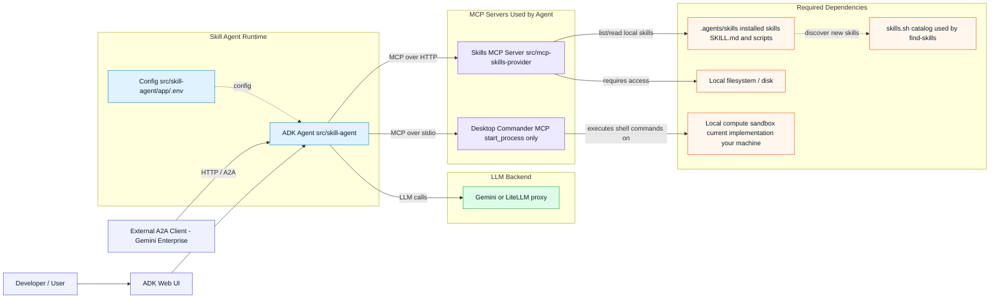

# Skilled ADK Agents

> [!WARNING]
> **DISCLAIMER**: The implementation in this repository is **not** meant for production use. It is intended solely for development, testing, and demonstration purposes.

## Overview / Introduction
This repository demonstrates how to build and operate advanced artificial intelligence agents using Google's Agent Development Kit (ADK). The project provides examples of agents equipped with extensible "skills" (via MCP servers or native toolsets) capable of performing complex actions. It showcases how developers can test agents locally through the ADK web tool or expose them over the Agent-to-Agent (A2A) protocol to connect seamlessly with broader platforms like Gemini Enterprise.

> [!WARNING]
> Please be aware that this solution may execute shell commands on your local machine to fulfill certain agent capabilities (like installing skills). This can lead to unwanted or unforeseen behavior. Proceed with caution and ensure you understand the actions the agent is instructed to perform.

### Repository Structure & Architecture
The project logic is organized into several key directories:
- **`.agents/` folder**: This directory stores agent-specific configurations and modular tools. Notably, the `.agents/skills` subdirectory houses the executable tools, such as the `find-skills` capability, allowing the agent to dynamically discover and install new functionalities.
- **`src/` folder**: This contains the core application logic, split into two main components:
  - `src/skill-agent`: The primary directory for the ADK agent's logic and the A2A server endpoint setup. The agent acts as the decision engine that queries tools and processes responses.
  - `src/mcp-skills-provider`: A standalone Model Context Protocol (MCP) server that acts as a unified provider for the skills located in the `.agents/skills` directory. The main ADK agent connects to this MCP server over HTTP/STDIO to utilize these external tools safely and consistently.

### Conceptual High-Level Architecture


Flow summary: users interact through ADK web or A2A, the ADK agent calls two MCP servers (Skills + Shell), and those servers depend on local resources (filesystem and compute). New skills discovered by `find-skills` come from [skills.sh](https://skills.sh/).

## Prerequisites & Setup

**Requirements**
- **Python 3.12+** (see `pyproject.toml` / `requires-python`)
- **Git** to clone the repository
- **Node.js and npm** (required for Desktop Commander shell MCP and optional `npx` steps such as the skills CLI or `npx ngrok`)

### 1. Create a virtual environment and install dependencies

From the **repository root**:

```bash
python3 -m venv .venv
source .venv/bin/activate   # Windows: .venv\Scripts\activate
pip install --upgrade pip
pip install -r requirements.txt
```

This installs the ADK app stack (`google-adk`, MCP, etc.); see `requirements.txt` for the exact pins.

### 2. (Optional) Development tooling and git hooks

Linting is defined in [`.pre-commit-config.yaml`](.pre-commit-config.yaml) (ruff, ruff-format, pyright). GitHub Actions runs the same hooks via [`scripts/ci-lint.sh`](scripts/ci-lint.sh).

**Replicate the CI lint job locally** (fresh or existing clone):

```bash
./scripts/ci-lint.sh
```

For day-to-day development with git hooks:

```bash
pip install -r requirements.txt -r requirements-dev.txt
pre-commit install
pre-commit run --all-files
```

`pre-commit run --all-files` uses the same hook config as CI; `ci-lint.sh` also ensures `.venv` and app dependencies exist so pyright can resolve imports.

### 3. Environment variables

1. Copy the example env file to an active `.env` used by the agent:

   ```bash
   cp src/skill-agent/app/.env.example src/skill-agent/app/.env
   ```

2. Edit `src/skill-agent/app/.env` and set at least the Google Cloud / Vertex and agent settings (see the comments in `.env.example`). If you use the **in-repo MCP Skills Provider** (HTTP on port `5555` by default), keep `MCP_SKILLS_PROVIDER_ENDPOINT` in sync, or point it to your own MCP server.

`config` loads this file from `app/.env` automatically (you do not need a duplicate `.env` in the repo root for normal runs from `src/skill-agent`).

#### LiteLLM proxy

To route LLM calls through a [LiteLLM](https://docs.litellm.ai/) proxy instead of Gemini/Gemini Enterprise Agent Platform directly, set:

```bash
ADK_AGENT_MODEL=litellm
LITELLM_API_BASE=http://localhost:4000
LITELLM_MODEL=gemini-2.5-flash
LITELLM_VIRTUAL_KEY=sk-...
```

- `ADK_AGENT_MODEL` — set to `litellm` (case-insensitive) to enable proxy mode; any other value is used as a native ADK model id (e.g. `gemini-3.5-flash`).
- `LITELLM_API_BASE` — LiteLLM proxy root URL (e.g. `http://localhost:4000`; do not include `/v1`).
- `LITELLM_MODEL` — exact **Model Name** from LiteLLM Model Management. Any model on the proxy works; switch by changing this value only. Examples: `ollama/gemma3:4b.ollama`, `gemini-2.5-flash`, `gemini-3.1-pro-preview`. Use the full name (e.g. `ollama/gemma3:4b.ollama`, not `gemma3:4b.ollama`).
- `LITELLM_VIRTUAL_KEY` — virtual key with access to the chosen model.

Google Cloud / Vertex variables are not required in LiteLLM mode.

#### Desktop Commander (shell MCP only)

The skill agent uses [Desktop Commander](https://github.com/wonderwhy-er/DesktopCommanderMCP) **only** for shell execution (`start_process`, etc.). Skill discovery and documentation always go through the Skills MCP (`list_skills`, `read_skill`). Desktop Commander filesystem tools are not exposed to the agent.

- **Node.js and npm** must be installed.
- On first run, `config.py` creates `.desktop-commander/config.json` at the repo root from your `MCP_DESKTOP_COMMANDER_*` env vars (see `.env.example`).
- Terminal commands run with your user shell permissions — treat this as full local machine access during development.
- MCP tool calls are often capped near **60 seconds** regardless of `MCP_SHELL_RUNNER_SKILLS_INSTALL_TIMEOUT_SECONDS`.

See `src/skill-agent/app/desktop-commander.config.json.example` for the config shape.

### 4. (Optional) Pre-install agent skills

Pre-install skills with the Vercel `skills` CLI. **Optional** — the agent can also discover and install skills at runtime. Requires Node/npm for `npx`:

The `find-skills` workflow searches the public skills catalog at [skills.sh](https://skills.sh/).

```bash
npx skills add https://github.com/vercel-labs/skills --skill find-skills
```

### 5. (Optional) ngrok for public tunnels (e.g. Gemini Enterprise)

The examples below use `A2A_PORT=8001` and call ngrok; you can use a **globally installed** binary or `npx` (if you prefer not to install ngrok with your OS package manager).

- **macOS (Homebrew):** `brew install ngrok/ngrok/ngrok`
- **Debian / Ubuntu (apt):** see [ngrok’s Linux install guide](https://ngrok.com/docs/getting-started)
- **Any OS:** [download the binary](https://ngrok.com/download) or use `npx ngrok` as shown in the A2A section

## How to …

With your virtual environment **activated** (`source .venv/bin/activate` from the repo root), all commands below assume you are in the stated working directory.

### Start the MCP Skills Provider (when using the HTTP skills server)

If your `.env` points `MCP_SKILLS_PROVIDER_ENDPOINT` at the bundled provider (default `http://0.0.0.0:5555/mcp`), start the server **before** the ADK app.

**VS Code:** use the `mcp skills` launch configuration (see `.vscode/launch.json` — it sets `SKILLS_DIRECTORY` to the repo’s `.agents/skills` and `PORT=5555`).

**Terminal** (`server.py` defaults to the repository’s `.agents/skills` directory and port `5555` unless you set `SKILLS_DIRECTORY` or `PORT`):

```bash
cd src/mcp-skills-provider
python server.py
```

You can also use the MCP inspector or other clients; the critical part is that the URL in `.env` matches a running process.

### Run using Google’s ADK web tool
The ADK web UI is for day-to-day development and chat against the agent.

**Option 1: VS Code / Cursor (recommended)**  
Run and Debug → choose `adk web` (uses `src/skill-agent/app/.env` via `envFile` in `.vscode/launch.json`).

**Option 2: Terminal**  
With the venv active:

```bash
cd src/skill-agent
python -m google.adk.cli web --no-reload --log_level debug
```

If you rely on the MCP provider, start it (section above) first.

### Run using the A2A protocol
A2A lets other frameworks call your agent over HTTP.

**1. Start the A2A server**
- **VS Code / Cursor:** `adk a2a` in `.vscode/launch.json` (loads `app/.env`).
- **Terminal** (with venv active):

  ```bash
  cd src/skill-agent
  python app/a2a_agent.py
  ```

  Default port comes from `A2A_PORT` in `app/.env` (see `.env.example`, typically `8001`).

**2. Expose via tunnel (optional)**  
Use the same `A2A_PORT` as in `app/.env` (example below uses `8001`). If you use the MCP skills provider, start it before the agent, as in the web UI section.

```bash
A2A_PORT=8001
npx ngrok http $A2A_PORT --host-header="localhost:$A2A_PORT"
```

Copy the HTTPS forwarding URL (e.g. `https://SOMETHING.ngrok-free.dev`) into `TUNNEL_ADDRESS` in `src/skill-agent/app/.env`.

### Connect with Gemini Enterprise
To integrate your agent with Gemini Enterprise using the A2A protocol:
1. Ensure the A2A server is running and exposed publicly via a secure tunnel like ngrok (see above).
2. Use the ngrok tunneling forwarding URL as the endpoint base URL to get the A2A agent card (using the URL like `<ngrok-url>/.well-known/agent.json`).
3. In Gemini Enterprise, register a new A2A Agent. When asked, provide the retrieved A2A agent card.
4. Open Gemini Enterprise's end-user web frontend and start interacting with the agent.